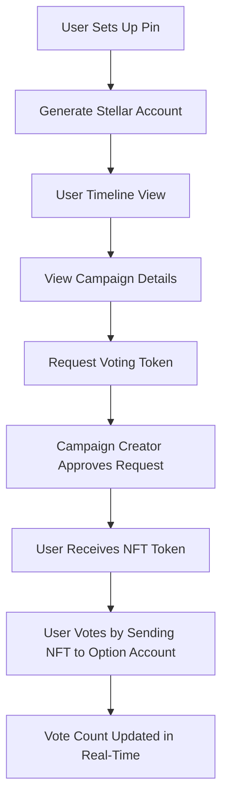
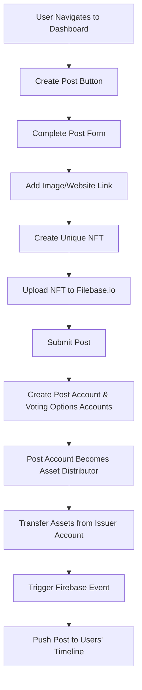

# Vote38
## DEMO VIDEO https://www.loom.com/share/d22fd117f6c841fb94db77de9794e519
## Introduction

Vote38 is a decentralized, non-custodial opinion poll and voting platform built on the Stellar Network. It leverages blockchain technology to ensure secure, transparent, and tamper-proof voting processes. This platform uses Flutter for mobile app development and Firebase for real-time data streaming, providing a seamless and interactive user experience.
## Note on building project from source code.
- You will need to add a firebase service account which is removed for security to not leak firebase credentials on github.
- Install flutter SDK if you do not have one already.
- Run command in project directory `flutter run`

## Features

- **Secure Voting**: Each vote is a blockchain transaction, ensuring transparency and security.
- **Real-Time Updates**: Firebase streams real-time data to keep users updated on voting results.
- **User-Friendly Interface**: Built with Flutter, the app offers an intuitive interface for creating polls, voting, and viewing results.
- **Non-Custodial**: Users control their data and assets, enhancing security and privacy.

## Technical Overview

### Technologies Used

- **Stellar Network**: For managing accounts, NFTs, trustlines, and token transfers.
- **Flutter**: For building a cross-platform mobile app.
- **Firebase**: For real-time data streaming and updates.
- **Filebase.io**: For NFT storage.

## Flow Diagrams

### User Voting Flow



### Post Creation Flow



## Detailed Workflow

### User Voting Flow

1. **Pin Setup**: User sets up a pin for secure access to the app.
2. **Generate Stellar Account**: The app generates a Stellar account using the Stellar Flutter SDK.
3. **Timeline View**: User navigates to the timeline view to see available campaigns.
4. **View Campaign Details**: User clicks on a campaign to view details.
5. **Request Voting Token**: User requests a voting token from the campaign creator.
6. **Approve Request**: The campaign creator approves the request, sending 1 NFT asset to the user, making them eligible to vote on that campaign.
7. **Vote**: User selects a voting option, and the NFT is sent to the option's account, updating the vote count in real-time.

### Post Creation Flow

1. **Navigate to Dashboard**: User navigates to the dashboard tab.
2. **Create Post**: User clicks the "Create Post" button.
3. **Complete Post Form**: User fills out the form, including optional image and website links.
4. **Create Unique NFT**: User opens the NFT tab to create an NFT unique to the post.
5. **Upload NFT**: The NFT is uploaded to Filebase.io.
6. **Submit Post**: User submits the post, triggering the following actions:
    - **Create Post Account**: A Stellar account for the post is created, which also acts as the asset distributor.
    - **Create Voting Options Accounts**: Accounts for each voting option are created, each with a trustline to the custom NFT.
    - **Transfer Assets**: All assets are transferred from the issuer account to the post account.
    - **Trigger Firebase Event**: A Firebase event is triggered to push the created post to all users' timelines.

## Security Measures

- **Non-Custodial Storage**: All user data and assets are stored locally, ensuring users maintain control over their information.
- **Authorization Required Flag**: Implemented to prevent multiple voting, ensuring each user can only vote once per campaign.

## Example Code Snippets

### Approving a Trustline in Dart

```dart
import 'package:stellar_flutter_sdk/stellar_flutter_sdk.dart';

Future<void> approveTrustline(
    String issuerAccountId, 
    String issuerSecret, 
    String accountToApprove, 
    Asset issuedAsset) async {

  final server = Server("https://horizon.stellar.org");
  final KeyPair issuerKeypair = KeyPair.fromSecretSeed(issuerSecret);

  // Load issuer account
  final issuerAccount = await server.accounts.account(issuerAccountId);

  // Create the transaction builder
  final transactionBuilder = TransactionBuilder(issuerAccount)
    ..addOperation(SetTrustLineFlagsOperationBuilder(
      accountToApprove, 
      issuedAsset, 
      setFlags: TrustLineFlags.AUTHORIZED_FLAG)
    )
    ..setTimeout(30);

  // Build the transaction
  final transaction = transactionBuilder.build();

  // Sign the transaction
  transaction.sign(issuerKeypair);

  // Submit the transaction
  await server.submitTransaction(transaction);
}
```

### Usage Example

```dart
void main() async {
  const String issuerAccountId = 'G...'; // Issuer Account ID
  const String issuerSecret = 'S...'; // Issuer Secret Seed
  const String accountToApprove = 'G...'; // Account to approve
  final Asset issuedAsset = AssetTypeCreditAlphaNum4('TOKEN', issuerAccountId); // Issued Asset

  await approveTrustline(issuerAccountId, issuerSecret, accountToApprove, issuedAsset);
}
```

## Conclusion

Vote38 combines the power of blockchain technology with user-friendly mobile interfaces and real-time data streaming to create a secure and transparent voting platform. By leveraging the Stellar Network, Flutter, and Firebase, Vote38 offers a robust solution for community engagement, organizational decision-making, and event planning.
